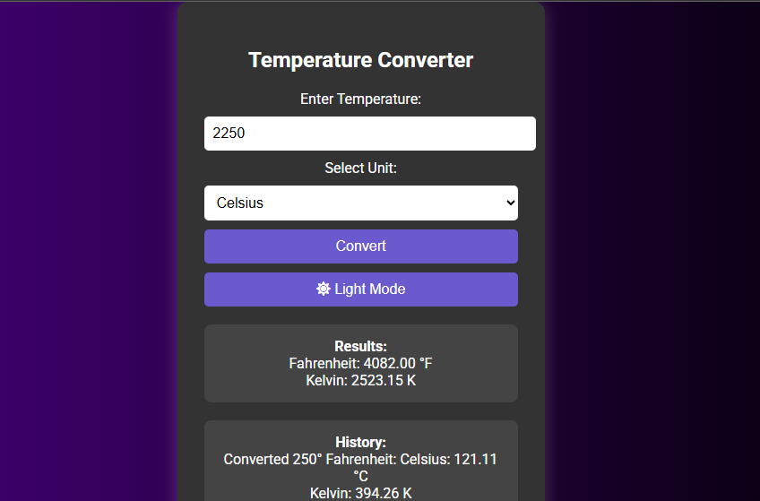

# Temperature Converter 🌡️

A simple and interactive web app to convert temperatures between Celsius, Fahrenheit, and Kelvin. 

## Features

- Convert temperatures between Celsius, Fahrenheit, and Kelvin
- View a history of your last 5 conversions
- Toggle between Dark Mode and Light Mode with a single click
- Responsive and user-friendly design

## Demo

![Screenshot]

## How to Use

1. Enter the temperature value.
2. Select the unit (Celsius, Fahrenheit, Kelvin).
3. Click **Convert** to see results.
4. Use the **Theme Toggle** button to switch between Light and Dark mode.

## Getting Started

1. **Clone or download this repository**  
   ```
   git clone https://github.com/YOUR-USERNAME/YOUR-REPO.git
   ```
2. **Open `index.html` in your browser**  
   No installation needed!

## Author

- [Prem Kumar](https://github.com/premingg)

---

Feel free to use or modify this project for learning or personal use.
